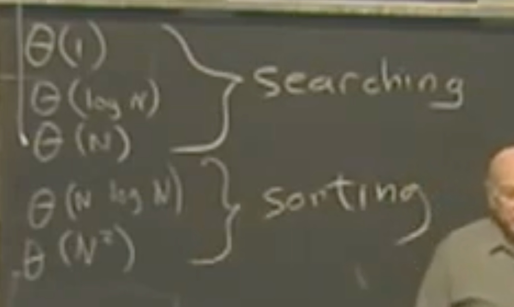
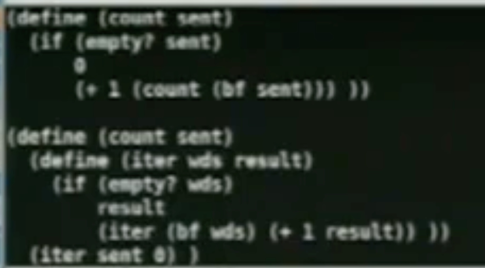

# Lecture 08 - Recursion and iteration

## Summary

In this lesson we discuss the differences in time and space complexity of recursive vs iterative methods of implementing a procedure. We also discussed about the benefits of tail recursion.

## Questions

- What is a LISP? What are the specificities of the different LISP dialects?
- How does tail recursion calls work? Why is it more efficient? Why do we need it?

## Lecture

Time complexity

Space efficiency

Is less relevant than when the book was written because the size of RAM was in KB's (now in GB or TB). If your program is less memory efficient it will be slower.

Recursive processes are less memory efficient than iterative processes in certain implementations. This is why the Scheme interpreter can notice recursive calls and see if there tail recursion call enabling optimizations.

Think hard about what makes your program inneficient and the time complexity.

Go with recursion for now instead of iteration because it's simpler to write and only has a space complexity benefit.
