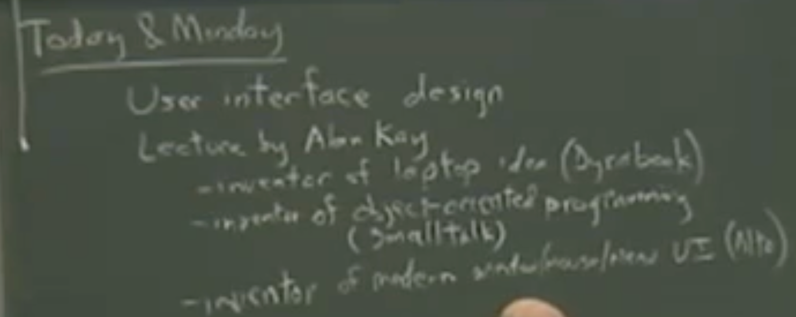

# Lecture 05 - User interface

## Summary

Dr. Alan Kay pioneer of user interfaces talks about the different innovations leading to todays computer interfaces.

## Questions

None

## Lecture

[Dr. Alan Kay](https://en.wikipedia.org/wiki/Alan_Kay) talks about user interfaces -> Doing with images make symbols: User interface design

Person to person collaboration -> Being able to share your work with others

Degree of intimacy with the device -> Use it as if it was part of you, it understands what you want / need

Computer litteracy: Access -> being able to read, Creativity -> being able to write and create

Programming languages are powerful enough to let you start a revolution with 2 pages of well tought out code
