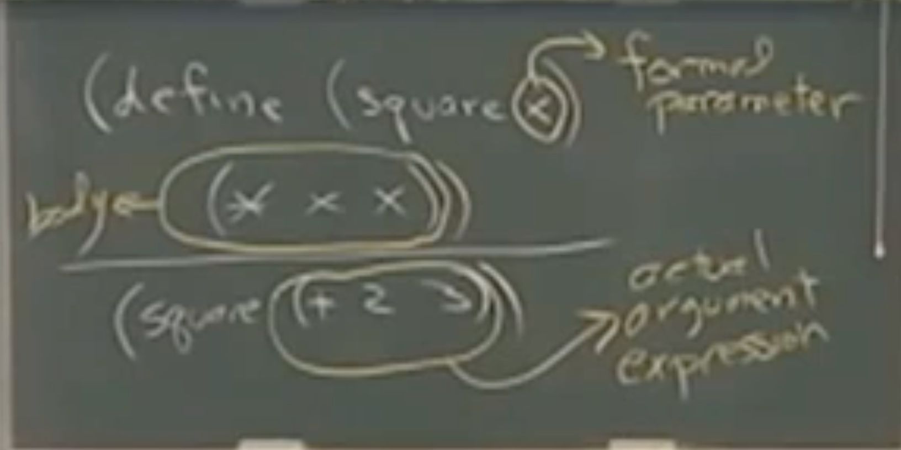

# Lecture 01 - Functional Programming

## Summary

In this lecture we learn the basics of Scheme and understand what are the prerequisites for this course.

## Lecture

Scheme is a dialect of Lisp that we will use during the course and book. It's a functional programming language.

Scheme uses the `prefix` notation for operators:

- `prefix`: (+ 1 2)
- `infix`: 1 + 2
- `postfix`: 1!

We can also use the `'` symbol to `escape` values. If you write `hello` it will throw an error for an undefined var. But if you write `'hello` it will consider it as a value.

We can use the keyword `define` to assign names to variables, procedures or others.

Scheme uses evaluation rules to evalaluate expressions:

- First evaluate the sub expressions, then evaluate the expression, Ex:

```scheme
(+ (+ 3 2) 5) # Will equate to 10
```

- There are also some expressions or keywords that have evaluation exceptions:

```scheme
(define (square x) (* x x))
(square 10)
```

The `define` keyword is called a `special form` and has a specific evaluation rule considering that if it followed the classical evaluation rule it's expression would error out telling us that`square` is an unbound variable.



In Scheme we can also use `if` as a conditional keyword and predicates like `equal?`. By convention predicates end with a `?` Ex:

```scheme
(define (five x) (if (equal? x 5) 'five 'not_five))
```

`if` is also a special form.

Recursion is a prerequisite of this course.
