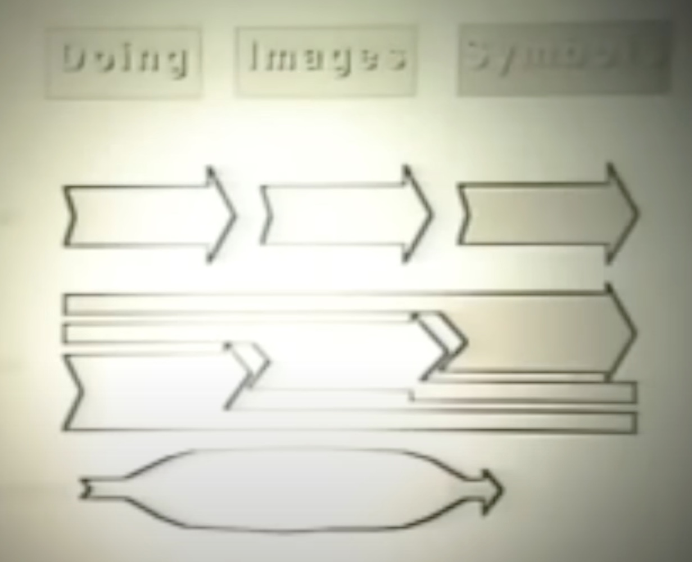
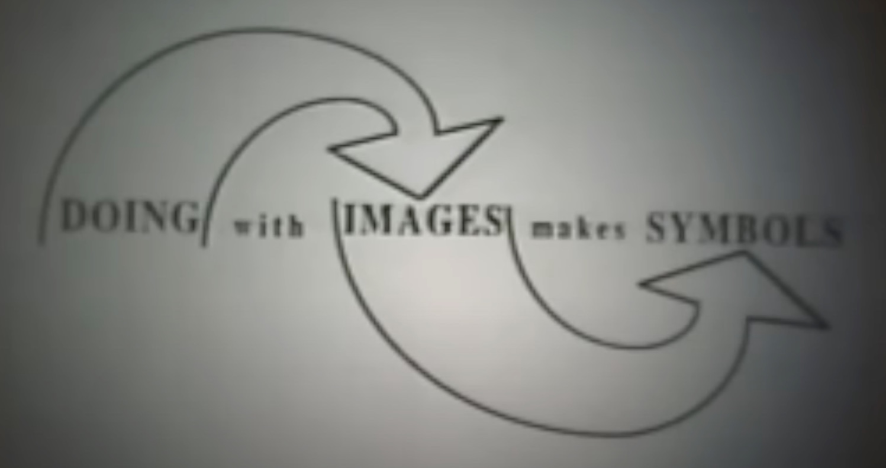

# Lecture 06 - User interface

## Summary

In the second part of Dr. Alan Kay presentation we learn about some of the reasons behind the design choices that they made for user interfaces. They used psychological research and user feedback to imagine machine that would enable users to tap into their different `mentalities` and enable them to do what they wanted effortlessly. Extremely interesting video about learning tennis, learning by doing, feeling and letting the right `mentalities` do the right job.

## Questions

- What is SmallTalk? I thought that it was a programming language.
- What is UNIX?

## Lecture

We take all of the user interfaces for granted. In every application, every operating system. They have been standardised and there are reasons for why that worked out to be.

We have different channels to sense the world (eyes, ears, touch, etc...) and they can all perceive different information regarding the same data. Auditive + Visual learning for example.

They have found 3 different stages of conciousness that they call `mentalities`:

- Action
- Images
- Symbols

They are thought to be developed in different stages by humans, childs start by acting, then start being dominated by images and then start thinking about meaning and symbols / logic. Another theory has added precision to the first one discovering that they are actually all 3 active at all times and they are different mediums of perception of life. Hence we can tap into them to perceive life. Some of them can be better mediums for doing or learning, for example most mathematicians do not use pure logic to do their craft but feel mathematics as something very concrete (Action > Symbols) even though we would think otherwise.

Try to feel, _Learning happens when attention is focused_ by removing interferance, to learn most things you need to short-circuit this mentality that not the right one that tries to take over. Learn better and quicker if you let the mind and body do it's own thing: [Inner game of tennis by Time Gallwey](https://www.youtube.com/watch?v=HzR8x5MgvDw)

_The point of view is worth 80 IQ points_ logic needs to be used in the right context. Find the right context that will do most of the work for you, let you do your work. In CS it's called choose the right Data Structure before you start tinkering with the algorithm, most work will be already done for you.

All of these mentalities should be used together.

_What would a computer be if it were like a pencil?_ (The pencil being one of the best user interfaces between the human and the real world, absolute freedom, you can do everything with a pencil: draw, maths, code, write, etc...)

If you want people to go along with you, you need to involve them in the same conspiracy. (motivate and inspire people)

A computer is a medium for learning that can amplify and support students.

Thinking from _first principles_.

Engineering and Sciences are Arts. Before becoming technical, being an aestetic, strongest link with your work.

[Xerox alto]()
[MIT Lisp machine]()

Build systems that are approachable and easy to use by all (Walk up and use / plug and play) but retain all capabilities of the machine enabling skill increase.
