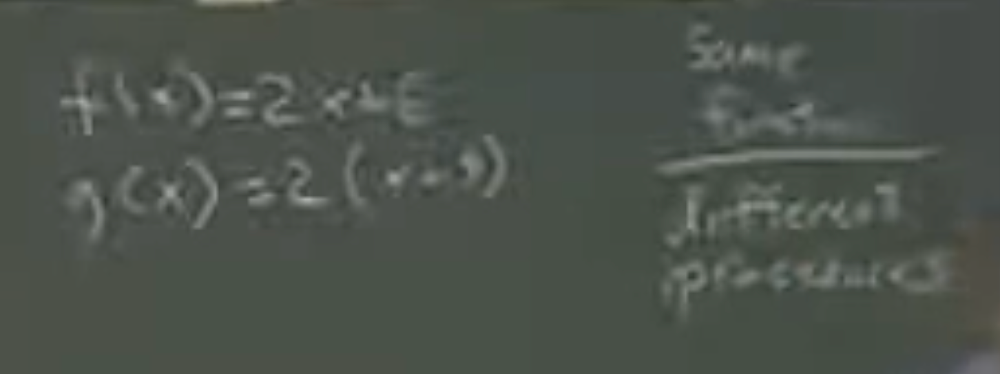

# Lecture 02 - Functional programming

## Summary

In this lecture we learn about why the functional paradigm of programming is interestinwhy the functional paradigm of programming is interesting. We also learn about the difference between functions and procedures and understand what are different types of evaluation rules.

## Lecture

CS is a bad name because it's more engineering that science. We are building and not researching.

CS is about managing complexity -> chunking complexity in manageable pieces

We will learn about different programming paradigms:

- Functional
- Object oriented
- Client server
- Logic
- Etc...

Abstraction:

- Application
- High level language
- Low level languages
- Computer architecture
- Logic gates
- Transistors -> Represent boolean values
- Quantum physics

Functions are interesting (this is why we use a functional language):

- We can prove theorems about functions
- Functions can be stateless
- Functions are great for parralelism

In this examples we can see 2 functions `f` and `g`:

- They will always give the same output if given the same input hence we can say that they are the same `function`.
- Nonetheless they are not the same `procedure` because the do not have the same internal instructions.

`random` considering that it will not always return the same answer is a procedure but not a function.

Scheme follows `applicative order` evaluation another way to evaluate expressions is `normal order`, [learn more](https://sookocheff.com/post/fp/evaluating-lambda-expressions/).

If you use functional programming you do not need to think about evaluation order, if not you need to.
