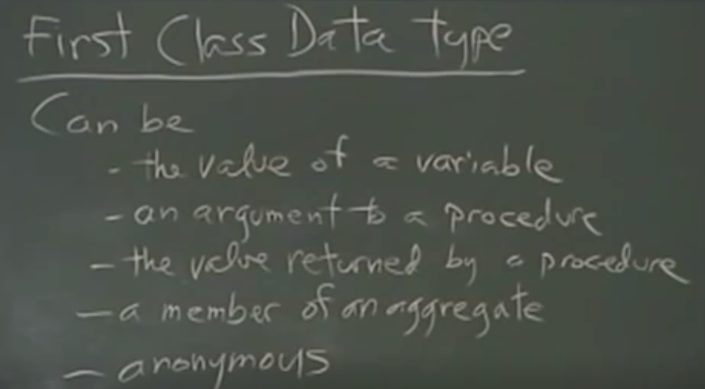

# Lecture 04 - Higher order procedures

## Summary

In this lecture we learned about functions that can return other functions (they can be used to construct other functions). We also learned about the `let` keyword that let's us define local variables inside our procedures. We learned more about the power of `lambda` and to what extent can we use functions.

## Questions

- How to deferentiate a procedure and a function?
- What is the use for `let`?

## Lecture

Big idea of this week -> Procedure as data

We could create a whole programming language with only `Lambda` and the ability to call procedures and it could do everything any other programming language could do.

You can build for loops, while loops, etc... with procedures.

_First class data type:_



Why is there more than 1 programming language?

In Scheme everything is a first class data type, if it's in the language it should be manipulabl, if it's in the language it should be manipulable.

As we pointed out previously higher order procedures are procedures that have a domain (input) or range (output) that can be other procedures, Ex:

```scheme
(define (make-adder num) (lambda (x) (+ x num))) # Higher order procedure returning a proc
(define plus3 (make-adder 3))
(define plus5 (make-adder 5))
(plus3 5) # Will output 8
(plus5 10) # Will output 15
```

We proved here that we can create a proc that returns another proc, hence `make-adder` is a higher order proc that is used to create other procs like `plus3` or `plus5`.

We are learning about the `let` and `let*` keywords, they enable the creation of local variables, [learn more](https://www.cs.utexas.edu/ftp/garbage/cs345/schintro-v14/schintro_54.html).

Ability to use procedures as data enables us to create any control mechanism we want.
