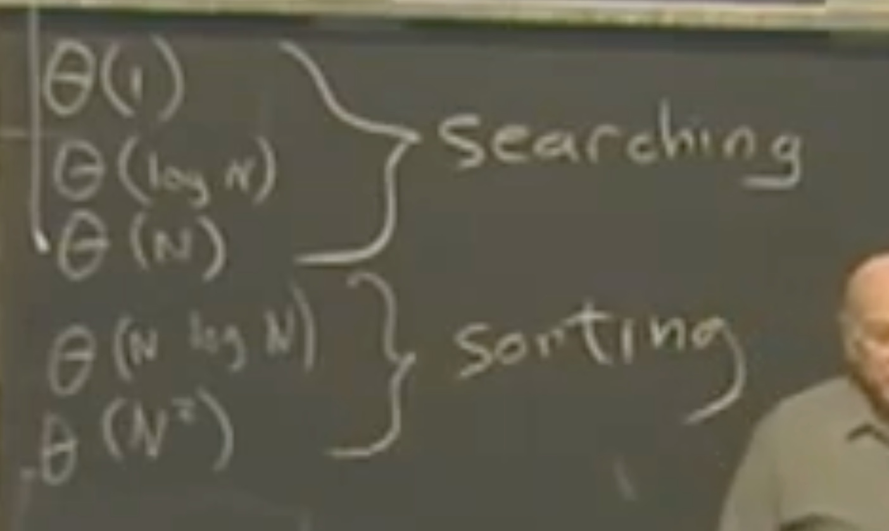

# Lecture 07 - Orders of growth

## Summary

In this lecture we looked at different measures of efficiency of programs: Time and Space. Looked at the big O and Theta notations of algorithms and showed why constants do not matter when doing significant computation.

## Questions

None

## Lecture

Topic of this week is the efficiency of programs. Make sure that your program works before you make it efficient.

Factors of efficiency:

- Programmed algorithm (code)
- Age of the computer (hardware)
- What is your computer doing (other running programs)

Which means that it's complicated to evaluate and compare different programs. Hence what we do is compare the number of primitive constant time operations the program does.

Make sure that the domain and range of your function is coherent: it will always take X as input and return Y as output (for example).

Big O notation and time comparisons.

